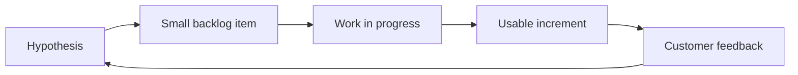

# روز صفر — مبانی Agile، Scrum و Kanban

> پیش از شروع گزارش‌گیری و KPI، باید بدانیم چه نوع سیستمی را اندازه می‌گیریم. روز صفر زبان مشترک دوره را می‌سازد.

## اهداف یادگیری

- تفاوت Agile، Scrum و Kanban را توضیح دهید.
- ارزش، Outcome، Output و Activity را از هم جدا کنید.
- یک Workflow ساده و Definition of Done بسازید.
- تشخیص دهید چه زمانی Scrum و چه زمانی Kanban مناسب‌تر است.

| فایل | نتیجهٔ مورد انتظار |
|---|---|
| [agile-principles.md](agile-principles.md) | ذهنیت و اصول تصمیم‌گیری |
| [scrum-and-kanban.md](scrum-and-kanban.md) | انتخاب روش کار متناسب با مسئله |
| [working-agreement.md](working-agreement.md) | قرارداد کار تیم و Definition of Done |
| [practice-lab.md](practice-lab.md) | یک Board آزمایشی آماده برای ادامهٔ دوره |

## منبع اصلی

[Scrum Guide رسمی](https://scrumguides.org/scrum-guide.html?from=hub) مرجع Scrum است. این دوره از آن پیروی می‌کند و فرایندهای محلی را جایگزین تعاریف Scrum نمی‌کند.
