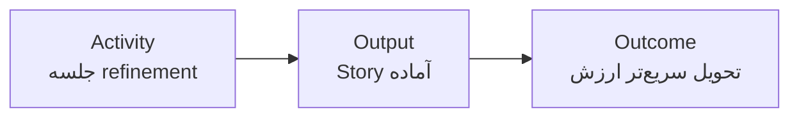

# Agile Principles in Practice

Agile مجموعه‌ای از مراسم یا ابزارها نیست؛ یک شیوهٔ کار برای یادگیری سریع در شرایط عدم‌قطعیت است.

| به‌جای تمرکز صرف بر | روی این تمرکز کنید | پرسش روزانه |
|---|---|---|
| پرکردن برنامه | تحویل ارزش کوچک و قابل‌آزمون | امروز چه چیزی قابل مشاهده شد؟ |
| استفادهٔ کامل از افراد | جریان سالم کار | کجا کار منتظر مانده است؟ |
| گزارش سبز | شفافیت مسئله و ریسک | چه چیزی ما را غافلگیر کرد؟ |
| تخمین قطعی | Forecast همراه با بازه و فرض | چه چیزی Forecast را تغییر می‌دهد؟ |

## Outcome، Output و Activity

- **Activity**: کاری که انجام می‌دهیم؛ مانند جلسه یا نوشتن Ticket.
- **Output**: چیزی که تحویل می‌دهیم؛ مانند Feature یا گزارش.
- **Outcome**: تغییری که ایجاد می‌شود؛ مانند کاهش زمان انتظار مشتری.

در طول دوره، Dashboard و KPI را با Outcome وصل کنید؛ اگر تصمیمی را بهتر نمی‌کند، حذفش کنید.
