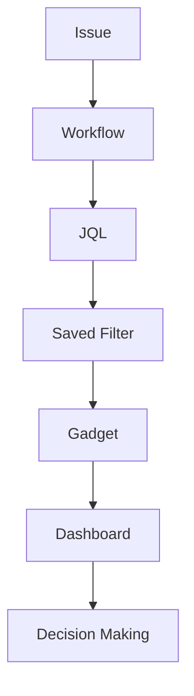

# Report vs Dashboard vs Gadget vs Filter vs JQL

> یکی از رایج‌ترین دلایل سردرگمی کاربران Jira، تفاوت بین این پنج مفهوم است. در این فایل، ارتباط و تفاوت آن‌ها را به‌صورت کامل بررسی می‌کنیم.

---

# معماری کلی



تمام گزارش‌های Jira از همین مسیر ساخته می‌شوند.

---

# سلسله مراتب

```
Issue

↓

JQL

↓

Filter

↓

Gadget

↓

Dashboard

↓

Report

↓

Management Decision
```

> **نکته:** در برخی موارد Report مستقیماً از داده‌های پروژه استفاده می‌کند و الزاماً از Dashboard عبور نمی‌کند. این نمودار برای درک ارتباط مفهومی اجزا ارائه شده است.

---

# 1. Issue

## تعریف

کوچک‌ترین واحد اطلاعات در Jira.

می‌تواند یکی از این موارد باشد:

- Story
- Task
- Bug
- Epic
- Spike
- Improvement
- Sub-task

---

## مثال

```
CRM-321

Title

Login Bug

Status

In Progress

Priority

High
```

---

## آیا گزارش است؟

❌ خیر

Issue فقط داده است.

---

# 2. JQL

## تعریف

Jira Query Language

زبان جستجوی Jira.

---

## مثال

```sql
project = CRM
AND issuetype = Bug
AND priority = High
```

---

## خروجی

```
42 Issues
```

---

## هدف

انتخاب داده.

---

## آیا نمودار تولید می‌کند؟

خیر.

---

# 3. Filter

## تعریف

Filter نسخه ذخیره‌شده یک Query است.

---

## مثال

نام Filter

```
Critical Bugs
```

JQL

```sql
project = CRM
AND priority = Highest
```

---

## مزایا

- قابل اشتراک‌گذاری
- قابل استفاده در Dashboard
- قابل Subscription
- قابل استفاده در Gadget

---

# 4. Gadget

## تعریف

یک Widget که داده‌های Filter یا پروژه را نمایش می‌دهد.

---

## مثال

```
Velocity

Pie Chart

Filter Results

Sprint Health
```

---

## ورودی

معمولاً یکی از این‌ها:

- Filter
- Project
- Sprint

---

## خروجی

نمودار، جدول یا آمار.

---

# 5. Dashboard

## تعریف

صفحه‌ای شامل چندین Gadget.

---

## مثال

```
Sprint Health

Velocity

Burndown

Critical Bugs

Activity Stream
```

---

## هدف

نمایش وضعیت کلی پروژه.

---

# 6. Report

## تعریف

تحلیل تخصصی داده‌ها.

---

## مثال

Sprint Report

Velocity Report

Version Report

CFD

Control Chart

---

## هدف

پاسخ به یک سؤال مدیریتی.

---

# تفاوت JQL و Filter

| JQL | Filter |
|------|--------|
| Query | Query ذخیره‌شده |
| موقت | دائمی |
| قابل اشتراک نیست | قابل اشتراک |
| داخل Search | قابل استفاده در Dashboard |

---

## مثال

JQL

```sql
status != Done
```

Filter

```
Open Issues
```

↓

همان Query ذخیره شده است.

---

# تفاوت Filter و Gadget

Filter

↓

داده را انتخاب می‌کند.

---

Gadget

↓

داده را نمایش می‌دهد.

---

مثال

```
Filter

↓

Critical Bugs

↓

Filter Results Gadget

↓

Dashboard
```

---

# تفاوت Dashboard و Report

Dashboard

↓

نمای کلی

---

Report

↓

تحلیل

---

مثال

Dashboard

```
Velocity

Burndown

Critical Bugs

Roadmap
```

---

Report

```
Velocity Report

↓

۱۰ Sprint اخیر
```

---

# Dashboard چه زمانی بهتر است؟

اگر بخواهید:

- وضعیت امروز پروژه را ببینید.
- Daily Scrum برگزار کنید.
- KPIهای مهم را کنار هم مشاهده کنید.
- پروژه را روی مانیتور نمایش دهید.

---

# Report چه زمانی بهتر است؟

اگر بخواهید:

- Sprint را تحلیل کنید.
- Release را پیش‌بینی کنید.
- Bottleneck پیدا کنید.
- Performance را بررسی کنید.

---

# مقایسه کامل

| ویژگی | JQL | Filter | Gadget | Dashboard | Report |
|---------|-----|--------|---------|-----------|--------|
| داده تولید می‌کند | ❌ | ❌ | ❌ | ❌ | ❌ |
| داده را انتخاب می‌کند | ✅ | ✅ | ❌ | ❌ | گاهی |
| داده را نمایش می‌دهد | ❌ | ❌ | ✅ | ✅ | ✅ |
| نمودار دارد | ❌ | ❌ | برخی | بله | معمولاً |
| قابل اشتراک | ❌ | ✅ | داخل Dashboard | ✅ | لینک یا Export |
| قابل Export | ❌ | ✅ | محدود | PDF/Image | معمولاً |

---

# سناریوی واقعی

مدیر پروژه می‌گوید:

> «می‌خواهم همه Bugهای بحرانی را هر روز ببینم.»

مراحل:

### 1

نوشتن JQL

```sql
project = CRM
AND issuetype = Bug
AND priority = Highest
```

↓

### 2

Save Filter

```
Critical Bugs
```

↓

### 3

ساخت Dashboard

↓

### 4

اضافه کردن

```
Filter Results Gadget
```

↓

### نتیجه

هر بار Dashboard باز شود، آخرین Bugهای بحرانی نمایش داده می‌شوند.

---

# ارتباط با Reports

همین Filter را می‌توانید در:

- Pie Chart
- Two Dimensional Statistics
- Average Age
- Rich Filters
- eazyBI

نیز استفاده کنید.

---

# چه چیزی را نباید اشتباه بگیریم؟

❌ Dashboard جایگزین Report نیست.

---

❌ Filter جایگزین JQL نیست.

---

❌ Gadget بدون داده هیچ کاربردی ندارد.

---

❌ Report برای تحلیل است، نه مانیتورینگ لحظه‌ای.

---

# معماری Enterprise

```mermaid
flowchart LR

Issue

--> Workflow

--> Database

--> JQL

--> Saved Filter

--> Dashboard Gadget

--> Dashboard

--> Reports

--> Management

--> Business Decision
```

---

# Best Practices

✅ JQLهای تکراری را به Saved Filter تبدیل کنید.

✅ برای هر تیم Dashboard جداگانه طراحی کنید.

✅ از Filterهای مشترک استفاده کنید تا همه Gadgetها از یک منبع داده استفاده کنند.

✅ برای تحلیل‌های پیچیده از Report یا افزونه‌هایی مانند eazyBI استفاده کنید.

---

# سوالات متداول

### آیا Dashboard بدون Gadget معنی دارد؟

خیر.

---

### آیا Gadget بدون Filter کار می‌کند؟

بعضی Gadgetها بله (مثل Activity Stream)، اما بسیاری از آن‌ها برای نمایش داده به Filter یا Project نیاز دارند.

---

### آیا می‌توان یک Filter را در چند Dashboard استفاده کرد؟

بله.

این یکی از بهترین روش‌ها برای مدیریت گزارش‌هاست.

---

### آیا Reportها قابل شخصی‌سازی هستند؟

تا حدی.

برای گزارش‌های کاملاً سفارشی معمولاً از eazyBI، Custom Charts یا Rich Filters استفاده می‌شود.

---

# خلاصه

| مفهوم | نقش اصلی |
|--------|----------|
| Issue | داده |
| JQL | انتخاب داده |
| Filter | ذخیره انتخاب |
| Gadget | نمایش داده |
| Dashboard | نمایش چند Gadget |
| Report | تحلیل داده |
