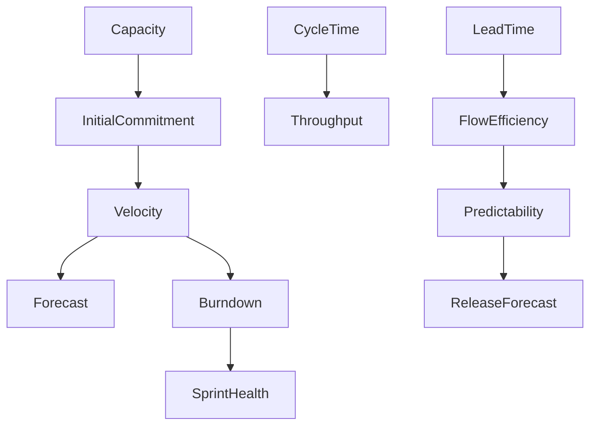

# Sprint Metrics

> در این بخش تمام شاخص‌هایی (Metrics) که برای مدیریت Sprint استفاده می‌شوند را بررسی می‌کنیم؛ از متریک‌های داخلی Jira تا شاخص‌هایی که با افزونه‌هایی مانند eazyBI، Tempo و Advanced Roadmaps قابل محاسبه هستند.

---

# اهداف یادگیری

پس از پایان این بخش، می‌توانید:

- عملکرد Sprint را تحلیل کنید.
- ظرفیت تیم را محاسبه کنید.
- پیش‌بینی Sprintهای آینده را انجام دهید.
- کیفیت برنامه‌ریزی Sprint را ارزیابی کنید.
- Dashboardهای مدیریتی طراحی کنید.
- KPIهای مناسب برای Scrum و Kanban را انتخاب کنید.

---

# Sprint Metrics چیست؟

Sprint Metric شاخصی است که عملکرد تیم را در طول یا پایان یک Sprint اندازه‌گیری می‌کند.

این شاخص‌ها به تصمیم‌گیری کمک می‌کنند و نباید به‌عنوان ابزار ارزیابی عملکرد فردی استفاده شوند.

---

# دسته‌بندی Sprint Metrics

```
Sprint Metrics

├── Planning Metrics
│   ├── Initial Commitment
│   ├── Final Commitment
│   ├── Capacity
│   ├── Team Availability
│   └── Scope Change
│
├── Delivery Metrics
│   ├── Velocity
│   ├── Burndown
│   ├── Burnup
│   ├── Throughput
│   └── Completion Rate
│
├── Flow Metrics
│   ├── Cycle Time
│   ├── Lead Time
│   ├── WIP
│   ├── Flow Efficiency
│   └── Queue Time
│
├── Quality Metrics
│   ├── Bug Rate
│   ├── Escaped Bugs
│   ├── Defect Density
│   ├── Reopened Issues
│   └── Defect Leakage
│
└── Predictability Metrics
    ├── Commitment Reliability
    ├── Predictability Index
    ├── Release Forecast
    └── Monte Carlo Forecast
```

---

# متریک‌های موجود در Jira

این متریک‌ها به‌صورت پیش‌فرض یا از طریق گزارش‌های داخلی Jira قابل مشاهده هستند:

| Metric | Built-in Jira |
|---------|---------------|
| Velocity | ✅ |
| Burndown | ✅ |
| Burnup | ✅ |
| Sprint Report | ✅ |
| Version Report | ✅ |
| Control Chart | ✅ |
| CFD | ✅ |

---

# متریک‌هایی که به افزونه نیاز دارند

| Metric | معمولاً با |
|---------|------------|
| Capacity | Tempo / Advanced Roadmaps |
| Initial Commitment | eazyBI / Rich Filters |
| Commitment Reliability | eazyBI |
| Focus Factor | eazyBI |
| Monte Carlo Forecast | ActionableAgile، eazyBI |
| Team Utilization | Tempo |
| Cost Metrics | Tempo Cost Tracker |
| Resource Allocation | BigPicture / Advanced Roadmaps |

---

# چرخه کامل یک Sprint


---

# سوالات کلیدی که متریک‌ها پاسخ می‌دهند

| سوال | Metric مناسب |
|-------|--------------|
| آیا Sprint بیش از ظرفیت برنامه‌ریزی شده است؟ | Capacity |
| آیا تیم به تعهد خود عمل کرده است؟ | Commitment Reliability |
| سرعت واقعی تیم چقدر است؟ | Velocity |
| آیا از برنامه عقب هستیم؟ | Burndown |
| چه مقدار کار انجام شده است؟ | Burnup |
| چند Issue تکمیل شده است؟ | Throughput |
| انجام هر کار چقدر طول می‌کشد؟ | Cycle Time |
| آیا کارها زیاد در انتظار می‌مانند؟ | Lead Time |
| آیا گلوگاه وجود دارد؟ | CFD |
| آیا Release به‌موقع انجام می‌شود؟ | Release Forecast |

---

# رابطه متریک‌ها



---

# نقش‌ها و متریک‌های مهم

| نقش | مهم‌ترین متریک‌ها |
|------|-------------------|
| Developer | Burndown، WIP، Cycle Time |
| Scrum Master | Velocity، Commitment، Burndown، CFD |
| Product Owner | Burnup، Forecast، Release Progress |
| QA Lead | Bug Rate، Reopened Issues |
| Project Manager | Capacity، Velocity، Forecast |
| Agile Coach | Flow Metrics، Predictability |
| CTO | Predictability، Release Forecast، Delivery Trend |

---

# اشتباهات رایج

❌ استفاده از Velocity برای مقایسه افراد

❌ افزایش مصنوعی Story Point برای بالا بردن Velocity

❌ برنامه‌ریزی Sprint بدون Capacity

❌ تحلیل Sprint فقط با Burndown

❌ نادیده گرفتن Scope Change

❌ تصمیم‌گیری بر اساس یک Sprint

همیشه روند چند Sprint متوالی را بررسی کنید.

---

# مسیر یادگیری Day 2

در ادامه این بخش، هر فایل به یکی از متریک‌های اصلی اختصاص دارد:

1. Velocity
2. Initial Commitment
3. Final Commitment
4. Capacity
5. Scope Change
6. Burndown
7. Burnup
8. Sprint Health
9. Forecasting
10. فرمول‌ها و KPIها

هر متریک با این قالب بررسی می‌شود:

- Definition
- Business Purpose
- Formula
- Data Source
- Jira Location
- Cloud vs Data Center
- Configuration
- Example
- Interpretation
- Enterprise Scenario
- Best Practices
- Common Mistakes
- Related Metrics
- Dashboard Usage
- Interview Questions
