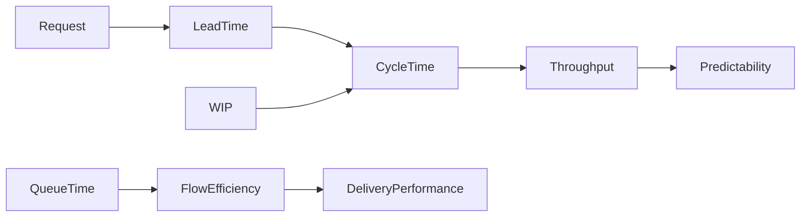

# Day 3 - Flow Metrics

> Flow Metrics مجموعه‌ای از شاخص‌ها هستند که نحوه حرکت کار (Work Items) را در سیستم اندازه‌گیری می‌کنند. این متریک‌ها پایه اصلی Kanban، Continuous Delivery و بسیاری از تیم‌های DevOps هستند، اما در Scrum نیز برای بهبود عملکرد استفاده می‌شوند.

---

# اهداف این بخش

پس از مطالعه این فصل می‌توانید:

- گلوگاه‌های فرآیند را شناسایی کنید.
- زمان واقعی تحویل کار را اندازه‌گیری کنید.
- بهره‌وری جریان کار را تحلیل کنید.
- قابلیت پیش‌بینی تیم را افزایش دهید.
- Dashboardهای مخصوص Kanban و Flow طراحی کنید.

---

# Flow Metrics چیست؟

Flow Metrics شاخص‌هایی هستند که به جای تمرکز بر Sprint، روی **جریان حرکت کار** تمرکز دارند.

به جای سؤال:

> "در این Sprint چند Story Point انجام شد؟"

پاسخ می‌دهند:

> "یک درخواست از زمان ایجاد تا تحویل، چقدر زمان صرف کرده است؟"

---

# تفاوت Sprint Metrics و Flow Metrics

| Sprint Metrics | Flow Metrics |
|----------------|--------------|
| مبتنی بر Sprint | مبتنی بر جریان کار |
| مناسب Scrum | مناسب Kanban و DevOps |
| تمرکز بر برنامه‌ریزی | تمرکز بر تحویل |
| Story Point محور | Time محور |
| Velocity مهم است | Cycle Time مهم است |

---

# مهم‌ترین Flow Metrics

```
Flow Metrics

├── Cycle Time
├── Lead Time
├── Throughput
├── Work In Progress (WIP)
├── Flow Efficiency
├── Queue Time
├── Waiting Time
├── Aging Work
├── Blocked Time
└── Flow Load
```

---

# ارتباط متریک‌ها



---

# چرخه عمر یک Issue

```text
Issue Created
      │
      ▼
Backlog
      │
      ▼
Selected
      │
      ▼
In Progress
      │
      ▼
Code Review
      │
      ▼
Testing
      │
      ▼
Done
```

---

# Flow Metrics در چه نقش‌هایی مهم هستند؟

| نقش | اهمیت |
|------|--------|
| Scrum Master | ⭐⭐⭐⭐ |
| Kanban Coach | ⭐⭐⭐⭐⭐ |
| Agile Coach | ⭐⭐⭐⭐⭐ |
| DevOps Engineer | ⭐⭐⭐⭐ |
| Project Manager | ⭐⭐⭐ |
| CTO | ⭐⭐⭐⭐ |
| Product Owner | ⭐⭐⭐ |

---

# Flow Metrics موجود در Jira

| Metric | Jira Built-in |
|---------|---------------|
| Cycle Time | ✅ (Control Chart) |
| Lead Time | ⚠️ محدود / افزونه یا JQL |
| Throughput | ⚠️ غیرمستقیم |
| WIP | ⚠️ Dashboard/JQL |
| CFD | ✅ |
| Aging Work | ❌ افزونه |
| Blocked Time | ❌ افزونه |
| Flow Efficiency | ❌ افزونه یا محاسبه سفارشی |

---

# افزونه‌های مناسب

| افزونه | کاربرد |
|---------|--------|
| eazyBI | گزارش‌های پیشرفته |
| ActionableAgile | Flow Metrics، Monte Carlo |
| Rich Filters | Dashboardهای تعاملی |
| Custom Charts | نمودارهای سفارشی |
| Tempo | زمان و ظرفیت |
| Structure | تحلیل سلسله‌مراتبی |

---

# KPIهای کلیدی Flow

| KPI | هدف |
|------|-----|
| Cycle Time | کاهش زمان انجام کار |
| Lead Time | کاهش زمان تحویل |
| Throughput | افزایش خروجی |
| WIP | کنترل حجم کار هم‌زمان |
| Flow Efficiency | کاهش زمان انتظار |
| Queue Time | حذف صف‌های غیرضروری |

---

# رابطه با Kanban

Kanban تقریباً به‌طور کامل بر پایه Flow Metrics اداره می‌شود.

اصول اصلی Kanban:

- محدود کردن WIP
- کاهش Cycle Time
- افزایش Throughput
- حذف Bottleneck
- بهبود Flow Efficiency

---

# تفاوت Lead Time و Cycle Time

```
Lead Time

Issue Created
│
├───────────────┐
│               │
▼               ▼
Backlog     In Progress

Cycle Time شروع می‌شود
                │
                ▼
Done
```

- **Lead Time:** از لحظه ایجاد درخواست تا تحویل.
- **Cycle Time:** از لحظه شروع کار واقعی تا تحویل.

---

# Flow Metrics و Continuous Delivery

در تیم‌های Continuous Delivery معمولاً به جای Velocity، این شاخص‌ها بررسی می‌شوند:

- Cycle Time
- Lead Time
- Throughput
- Deployment Frequency
- Change Failure Rate
- Mean Time to Recovery (MTTR)

---

# اشتباهات رایج

❌ تمرکز فقط روی Velocity

❌ نادیده گرفتن زمان انتظار (Waiting Time)

❌ افزایش WIP بدون توجه به ظرفیت

❌ تحلیل فقط میانگین‌ها و نادیده گرفتن پراکندگی داده‌ها

❌ استفاده از Flow Metrics برای ارزیابی عملکرد فردی

---

# مسیر یادگیری Day 3

در ادامه این پوشه، هر فایل یکی از موضوعات زیر را به‌صورت عمیق پوشش می‌دهد:

1. Cycle Time
2. Lead Time
3. Throughput
4. Work In Progress (WIP)
5. Flow Efficiency
6. Cumulative Flow Diagram (CFD)
7. Control Chart
8. فرمول‌ها و KPIها
9. واژه‌نامه تخصصی
10. سوالات مصاحبه و منابع

---

# نتیجه مورد انتظار

پس از پایان Day 3 می‌توانید:

- عملکرد یک تیم Kanban را تحلیل کنید.
- گلوگاه‌های فرآیند را پیدا کنید.
- Dashboardهای حرفه‌ای Flow طراحی کنید.
- متریک‌های Scrum و Kanban را با هم مقایسه کنید.
- گزارش‌های Control Chart و CFD را به‌درستی تفسیر کنید.
- برای بهبود زمان تحویل، تصمیم‌های مبتنی بر داده بگیرید.
