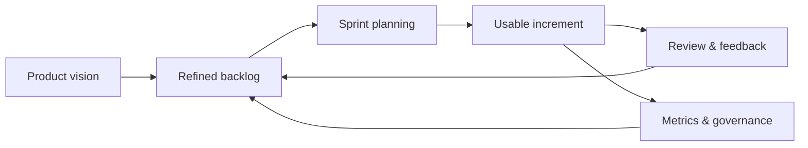

# Day 6 — Advanced Scrum & Jira Administration

> از اجرای یک Sprint تا طراحی قابل ادارهٔ Jira در محیط Enterprise. این روز، اتصال رفتار Scrum، پیکربندی Jira، گزارش‌گیری و Governance را پوشش می‌دهد.

## خروجی‌های روز

- Product Backlog و Sprint policy مستند
- Board، Workflow و گزارش‌های Jira با قرارداد روشن
- Definition of Ready و Definition of Done قابل اجرا
- الگوی Governance برای تغییرات و عملیات Jira

## ترتیب مطالعه

| موضوع | فایل | هدف |
|---|---|---|
| طراحی Backlog و Planning | [backlog-and-planning.md](backlog-and-planning.md) | آماده‌سازی و انتخاب کار Sprint |
| پیکربندی Scrum در Jira | [jira-scrum-configuration.md](jira-scrum-configuration.md) | Board، Workflow، Sprint و گزارش |
| Scrum در Enterprise | [scrum-best-practices.md](scrum-best-practices.md) | اجتناب از ضدالگوهای رایج |
| معماری و مقیاس | [scrum-enterprise-architecture.md](scrum-enterprise-architecture.md) | ساختار تیم‌ها و گزارش‌ها |
| اجرای واقعی | [real-world-implementation.md](real-world-implementation.md) | روند عملیاتی روزانه تا Release |
| Playbook عملیاتی | [operational-playbook.md](operational-playbook.md) | نقش‌ها، تصمیم‌ها و بهبود مستمر |
| سناریو و مصاحبه | [interview-and-enterprise-scenarios.md](interview-and-enterprise-scenarios.md) | تصمیم‌گیری سناریومحور |
| Blueprint نهایی | [final-enterprise-blueprint.md](final-enterprise-blueprint.md) | جمع‌بندی مدل Enterprise |

## سه guardrail اصلی

1. Jira باید روش کار تیم را نمایان کند، نه آن را با Workflow پیچیده پنهان کند.
2. Story Point ابزار Forecast تیم است؛ برای مقایسهٔ افراد یا تیم‌ها استفاده نمی‌شود.
3. هر تغییر در Workflow، Permission یا Automation باید مالک، تست و برنامهٔ بازگشت داشته باشد.

## منابع

- [Scrum Guide رسمی](https://scrumguides.org/scrum-guide.html?from=hub)
- [Jira Automation tutorials](https://www.atlassian.com/software/jira/guides/automation/tutorials)
- ادامهٔ مسیر: [روز ۷ — Automation و Governance](../07-Automation-Governance-and-Data-Quality/README.md)
