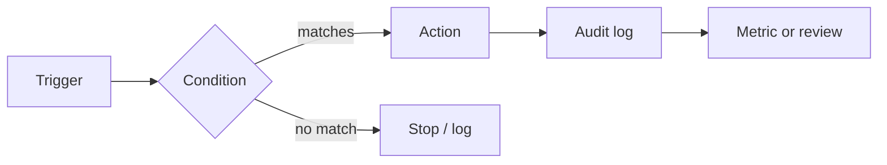

# Day 7 — Jira Automation, Governance & Data Quality

> هدف روز هفتم: Jira را به یک سیستم قابل‌اعتماد تبدیل کنید؛ سیستمی که دادهٔ درست تولید می‌کند، خطاهای تکراری را کم می‌کند و بدون تبدیل‌شدن به یک Workflow پیچیده قابل اداره است.

## خروجی‌های این روز

1. یک Data Dictionary برای فیلدها و وضعیت‌های اصلی پروژه.
2. سه Automation rule کوچک، آزمایش‌شده و قابل‌مالکیت.
3. Dashboard کیفیت داده و فرایند بازبینی ماهانهٔ آن.
4. مدل دسترسی حداقلی برای Project role، Filter و Dashboard.

## ترتیب مطالعه

| موضوع | فایل | خروجی |
|---|---|---|
| Automation طراحی‌شده | [automation-patterns.md](automation-patterns.md) | سه Rule با Trigger، شرط و مالک |
| کیفیت داده | [data-quality.md](data-quality.md) | قرارداد فیلدها و فیلتر کنترل |
| Governance | [governance-playbook.md](governance-playbook.md) | چرخهٔ تغییر، دسترسی و Audit |
| مصاحبه و سناریو | [interview-notes.md](interview-notes.md) | پاسخ‌های عملیاتی |

## معیار موفقیت

- Rule هرگز بدون Audit log و Owner منتشر نشود.
- یک Automation نباید جای تصمیم Product Owner یا تیم را بگیرد.
- هر فیلد اجباری باید مصرف مشخصی در گزارش، تصمیم یا انطباق داشته باشد.
- پیش از فعال‌سازی، Rule را با یک Issue آزمایشی و یک حالت شکست تست کنید.

## منابع رسمی

- [شروع کار با Jira Automation](https://support.atlassian.com/cloud-automation/docs/get-started-with-jira-automation/)
- [Automation tutorials](https://www.atlassian.com/software/jira/guides/automation/tutorials)
