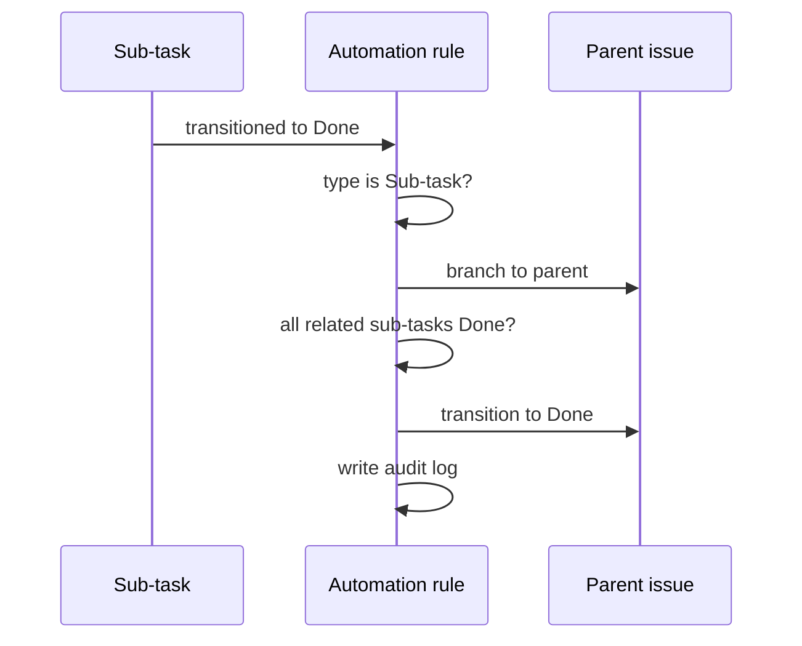

# Automation Patterns

## الگوی طراحی Rule

هر Rule را با جملهٔ زیر شروع کنید: «وقتی *رویداد X* رخ داد و *شرط Y* برقرار بود، Jira باید *اقدام Z* را انجام دهد تا *نتیجهٔ قابل‌اندازه‌گیری* حاصل شود.» اگر نتیجه روشن نیست، Rule نسازید.

| Rule | Trigger | شرط محافظ | Action | کنترل |
|---|---|---|---|---|
| بستن Parent | انتقال Sub-task به Done | همهٔ Sub-taskها Done باشند | انتقال Parent به Done | فقط Issue typeهای مجاز |
| یادآوری کار مانده | Scheduled روزانه | Issue در Sprint باز و بدون Update بیش از 3 روز | Comment یا اعلان به Assignee | از Spam با JQL محدود جلوگیری کنید |
| استانداردسازی Bug | Issue created | Issue type = Bug | افزودن Component/Label پیش‌فرض | مقدار پیش‌فرض قابل بازنویسی باشد |

## نمونهٔ Rule: Parent بعد از تکمیل Sub-taskها

## قبل از فعال‌سازی

- Scope پروژه و Issue typeها را محدود کنید.
- Actor حساب Rule را با کمترین مجوز لازم انتخاب کنید.
- Loopها را بررسی کنید؛ Rule نباید دوباره Trigger خودش شود.
- Error handling و Audit log را مرور کنید.
- نام نسخه‌دار بگذارید: `APP | Auto-close parent | v1`.

## ضدالگوها

- یک Rule بزرگ با چندین Branch و هدف نامشخص.
- ارسال اعلان برای هر Transition.
- تغییر خودکار Priority بدون سیاست Product Ownership.
- اتکا به نام Status به‌جای قرارداد روشن و تست‌شدهٔ Workflow.
