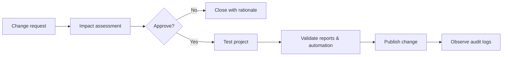

# Governance Playbook

## چرخهٔ تغییر Jira

| نوع تغییر | تصمیم‌گیر | حداقل کنترل |
|---|---|---|
| نام Dashboard یا Filter شخصی | Owner | تست نمایش و اشتراک‌گذاری |
| فیلد جدید پروژه | Project admin + گزارش‌گیر | Data dictionary و دلیل مصرف |
| Workflow / Screen / Permission | Jira admin + مالک فرآیند | تست در پروژهٔ آزمایشی، rollback plan |
| Automation سراسری | Jira admin + Security/Process owner | Audit، نرخ اجرا، مجوز Actor |

## دسترسی و مالکیت

- به جای اشتراک‌گذاری با «Everyone»، از Project role یا Group مناسب استفاده کنید.
- هر Filter، Dashboard و Rule یک Owner و یک تاریخ بازبینی داشته باشد.
- پس از خروج افراد از تیم، مالکیت دارایی‌ها را منتقل کنید.
- دادهٔ حساس را در Comment عمومی یا Automation message قرار ندهید.

## بازبینی ماهانه (30 دقیقه)

1. خطاهای Audit log و Ruleهای غیرفعال را ببینید.
2. فیلدهای خالی یا بدون مصرف را مرور کنید.
3. Dashboardهای بدون استفاده و Filterهای مشترکِ بی‌مالک را تعیین تکلیف کنید.
4. یک بهبود کوچک برای ماه بعد انتخاب کنید.
