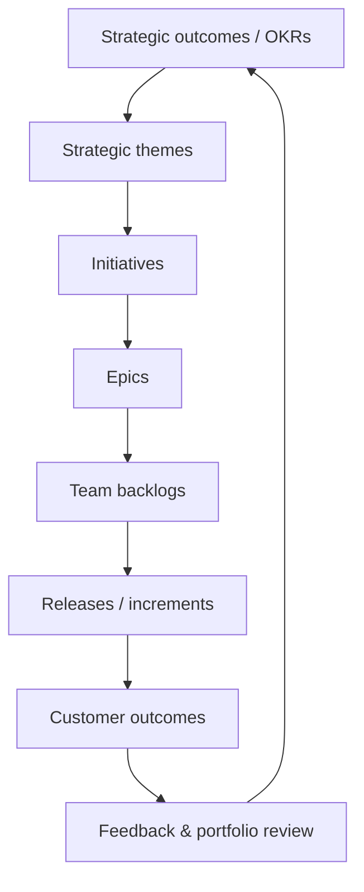

# Day 8 — Agile at Scale, Portfolio Management & Capstone

> هدف روز هشتم: از بهینه‌سازی یک تیم عبور کنید و اتصال «استراتژی → سرمایه‌گذاری → Portfolio → تیم‌ها → ارزش مشتری» را بسازید، بدون آن‌که استقلال تیم‌ها از بین برود.

## خروجی‌های این روز

1. یک Portfolio Kanban با معیارهای تصمیم‌گیری روشن.
2. یک Roadmap نتیجه‌محور که Initiative را تا Epic و تیم قابل‌ردیابی کند.
3. Cadence برای بازبینی Strategy، بودجه و ریسک‌ها.
4. پروژهٔ نهاییِ قابل ارائه برای یک سناریوی واقعی Jira.

## ترتیب مطالعه

| موضوع | فایل | خروجی |
|---|---|---|
| مدل عملیاتی Portfolio | [portfolio-operating-model.md](portfolio-operating-model.md) | Backlog و cadence Portfolio |
| وابستگی و ریسک | [dependency-management.md](dependency-management.md) | Dependency board و escalation policy |
| پروژهٔ نهایی | [capstone-project.md](capstone-project.md) | نمونهٔ کامل Dashboard، Automation و Roadmap |
| مصاحبه | [interview-notes.md](interview-notes.md) | پاسخ‌های سازمانی |

## انتخاب چارچوب

SAFe، LeSS، Scrum@Scale و مدل‌های سفارشی ابزارند، نه هدف. از کوچک‌ترین سازوکاری شروع کنید که یک مسئلهٔ واقعی—مانند وابستگی، اولویت‌بندی یا visibility—را حل می‌کند. سرعتِ یک تیم را با تیم دیگر مقایسه نکنید؛ در سطح Portfolio، Outcome، Flow، ریسک و زمان رسیدن به ارزش را ببینید.

## منابع رسمی

- [Agile at Scale — Atlassian](https://www.atlassian.com/agile/agile-at-scale)
- [Agile Portfolio Management — Atlassian](https://www.atlassian.com/agile/agile-at-scale/managing-an-agile-portfolio)
- [Lean Portfolio Management — Atlassian](https://www.atlassian.com/agile/agile-at-scale/lean-portfolio-management)
- [راهنمای برنامه‌ریزی بلندمدت Agile](https://www.atlassian.com/agile/agile-at-scale/long-term-agile-planning)
