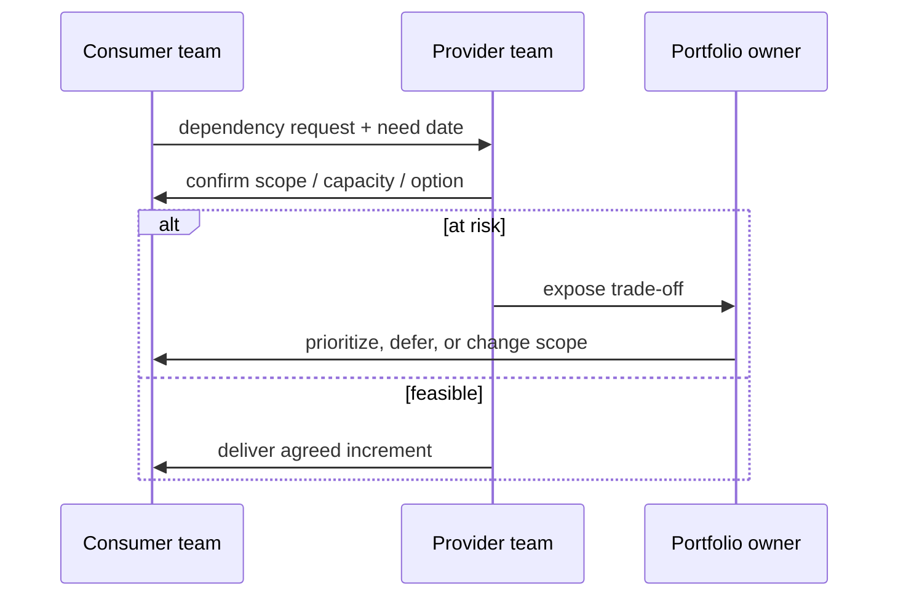

# Dependency & Risk Management

وابستگی را به‌عنوان یک جریان کارِ قابل‌دیدن مدیریت کنید، نه یک جدول پنهان در جلسه. هدف حذف همهٔ وابستگی‌ها نیست؛ هدف کوتاه‌کردن زمان کشف، تصمیم و رفع آن‌هاست.

## Dependency board

| فیلد | نمونه |
|---|---|
| Provider / Consumer | Platform team → Checkout team |
| نیاز | API پرداخت با idempotency |
| موعد نیاز | پیش از Sprint 18 |
| وضعیت | Proposed / Confirmed / At risk / Resolved |
| Owner | مالک فنی هر دو سمت |
| تصمیم بعدی | توافق قرارداد API در جلسهٔ معماری |

## سیاست escalation

1. تیم‌ها ابتدا مسئله، گزینه‌ها و موعد تصمیم را شفاف می‌کنند.
2. اگر تصمیم تا موعد ممکن نشد، آن را با اثر بر Outcome و گزینه‌های trade-off به سطح Portfolio می‌برند.
3. Portfolio owner یک تصمیم ثبت‌شده می‌گیرد: تغییر Scope، جابه‌جایی زمان، افزایش ظرفیت یا توقف.
4. نتیجه در Roadmap و Risk register به‌روزرسانی می‌شود.

## معیارهای مفید

- تعداد وابستگی‌های باز و سن آن‌ها
- درصد وابستگی‌های کشف‌شده پیش از شروع Sprint
- زمان متوسط تا تصمیم
- تعداد Blocked itemهای ناشی از وابستگی

این معیارها برای آشکارکردن گلوگاه هستند، نه سرزنش تیم Provider یا Consumer.
