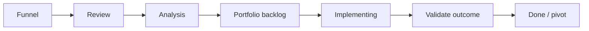

# Portfolio Operating Model

## Portfolio Kanban

هر ستون باید Policy صریح داشته باشد: چه چیزی وارد می‌شود، چه کسی تصمیم می‌گیرد، WIP limit چیست و خروجی لازم برای عبور چیست. برای نمونه، Initiative فقط زمانی از Analysis به Portfolio backlog می‌رود که فرضیهٔ ارزش، Owner، برآورد تقریبی و وابستگی‌های اصلی داشته باشد.

## اتصال Strategy به اجرا

| سطح | پرسش | نمونهٔ خروجی |
|---|---|---|
| Outcome / OKR | چه تغییری برای مشتری یا کسب‌وکار می‌خواهیم؟ | کاهش زمان فعال‌سازی مشتری از 3 روز به 1 روز |
| Theme | کدام جهت سرمایه‌گذاری به آن می‌رسد؟ | Self-service onboarding |
| Initiative | چه شرطی را آزمایش می‌کنیم؟ | بازطراحی تجربهٔ ثبت‌نام |
| Epic | چه قابلیت بزرگی لازم است؟ | Identity verification flow |
| Team backlog | چه Incrementهای کوچکی تحویل می‌دهیم؟ | API، UI، observability، آزمایش |

## Cadence پیشنهادی

| بازه | جلسه | تصمیم |
|---|---|---|
| هفتگی | Portfolio flow review | WIP، مانع، وابستگی، ریسک |
| ماهانه | Outcome review | ادامه، توقف یا تغییر فرضیه |
| فصلی | Strategy & funding review | اولویت و سرمایه‌گذاری مجدد |
| فصلی | Portfolio retrospective | بهبود شیوهٔ ادارهٔ Portfolio |

در بازبینی‌ها «خروجی تحویل‌شده» را از «نتیجهٔ حاصل‌شده» جدا کنید. یک Epic تمام‌شده بدون اثر مورد انتظار ممکن است نشانهٔ نیاز به Pivot باشد، نه موفقیت.
