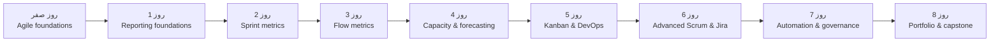

# مسیر کامل یادگیری Agile و Jira

این مسیر یک دورهٔ هشت‌روزه است: از دادهٔ صحیح در Jira تا ادارهٔ یک Portfolio چندتیمی. قبل از روز اول، [روز صفر](00-Agile-Foundations/README.md) را برای تثبیت مفاهیم Agile، Scrum و Kanban بخوانید. هر روز یک خروجی عملی دارد؛ فقط مطالعه نکنید، آن خروجی را در یک پروژهٔ آزمایشی Jira بسازید.

| روز | موضوع | خروجی عملی |
|---:|---|---|
| 0 | [Agile Foundations](00-Agile-Foundations/README.md) | چارچوب کار، Definition of Done و Board آزمایشی |
| 1 | [Jira Reporting Fundamentals](01-Jira-Reporting-Fundamentals/README.md) | Filter، گزارش و Dashboard پایه |
| 2 | [Sprint Metrics](02-Sprint-Metrics/README.md) | Sprint Health Dashboard و KPIهای تعهد |
| 3 | [Flow Metrics](03-Flow-Metrics/README.md) | تحلیل Lead Time، WIP و گلوگاه |
| 4 | [Capacity Planning & Forecasting](04-Capacity-Planning-and-Forecasting/README.md) | ظرفیت Sprint و Release Forecast |
| 5 | [Kanban & DevOps Metrics](05-Flow-Metrics-and-Kanban/README.md) | CFD، SLE و DORA Dashboard |
| 6 | [Advanced Scrum & Jira Administration](06-Advanced-Scrum-and-Jira-Scrum-Administration/README.md) | الگوی اجرایی Scrum در Jira |
| 7 | [Automation, Governance & Data Quality](07-Automation-Governance-and-Data-Quality/README.md) | Automation rulebook و کنترل کیفیت داده |
| 8 | [Agile at Scale & Capstone](08-Agile-at-Scale-and-Capstone/README.md) | Portfolio operating model و پروژهٔ نهایی |

## راهنمای اجرا و ارزیابی

- [راهنمای مدرس و دانشجو](course-guide.md): زمان‌بندی، ابزار لازم و روش مطالعه
- [تمرین‌ها و چک‌لیست روزانه](daily-labs.md): خروجی قابل‌تحویل هر روز
- [ارزیابی نهایی](final-assessment.md): Rubric و شرایط اتمام دوره

## اصول دوره

- ابتدا جریان کار و Definition of Done را روشن کنید؛ سپس شاخص اندازه بگیرید.
- معیارها برای بهبود سیستم‌اند، نه ارزیابی فردی.
- هر Dashboard باید به یک تصمیم یا اقدام مشخص منتهی شود.
- دادهٔ تاریخی را پاک نکنید؛ تغییرات Workflow و Automation را مستند و آزمایش کنید.

## منابع مرجع

- [Scrum Guide رسمی](https://scrumguides.org/scrum-guide.html?from=hub)
- [راهنمای Automation در Jira](https://support.atlassian.com/cloud-automation/docs/get-started-with-jira-automation/)
- [Tutorialهای Automation در Jira](https://www.atlassian.com/software/jira/guides/automation/tutorials)
- [Agile at Scale از Atlassian](https://www.atlassian.com/agile/agile-at-scale)
